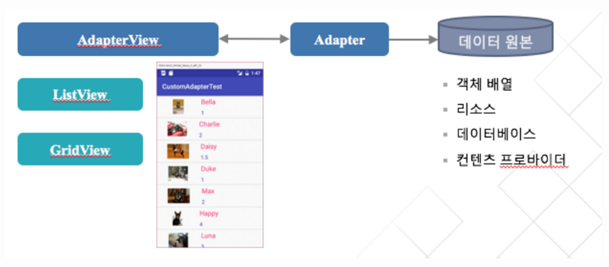
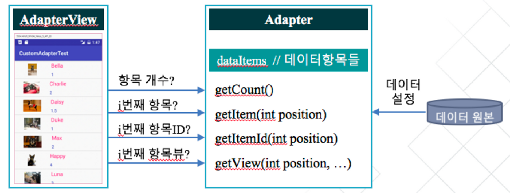
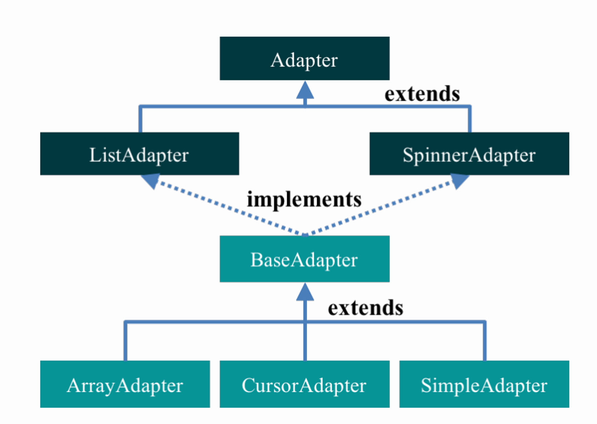

# [Android/Kotlin] 어댑터 뷰(Adaptor View)란?


* toc
{:toc}


## 📌 어댑터 뷰(Adaptor View)란?

- 어댑터 뷰는 여러개의 항목을 다양한 형식으로 나열하고 선택 할 수 있는 기능을 제공하는 뷰이다.
  - **리스트뷰(ListView) : 항목을 수직으로 나열시키는 방식**
  - **그리드뷰(GridView) : 항목을 격자 형태로 나열시키는 방식**
- **어댑터 뷰는 표시할 항목 데이터를 직접 관리하지 않고,어댑터라는 객체로부터 공급받는다.**



## 📌 어댑터(Adapter)란?

- 데이터를 관리하며 데이터 원본과 어댑터뷰(ListView, GridView) 사이의 중계 역할을 한다.
- 어댑터뷰가 데이터 항목을 표시하는 방식
  1. 어댑터뷰가 어댑터를 사용하기 위해서는 먼저 데이터 원본이 어댑터에 설정되어야 하고, 어댑터뷰에는 어댑터가 설정되어야 한다.
  2. 어댑터뷰는 항목을 표시하기 위해서 먼저 표시할 항목의 총 개수를 알 필요가 있을 것이다. 이 때, 어댑터 뷰는 어댑터의 getCount()란 메소드를 통해 현재 어뎁터가 관리하는 데이터 항목의 총 개수를 반환한다.
  3. 어댑터 뷰는 어댑터의 getView()란 메소드를 통해서 화면에 실제로 표시할 항목뷰를 얻고, 이를 화면에 표시한다.
- 사용자가 어댑터뷰의 특정 위치의 항목을 선택하였을 때, 어댑터뷰는 선택된 항목, 항목ID, 항목뷰를 어댑터의 getItem(), getItemId(), getView() 메소드를 통해 얻어와서 이를 항목선택 이벤트 처리기에 넘겨준다.



- 요약하면, 어댑터뷰는 어댑터에 정의된 인터페이스를 바탕으로 필요한 정보를 요청하여 항목뷰를 화면에 표시하거나 선택된 항목뷰를 처리한다.

## 🤔 Adapter의 종류

- **1) BaseAdapter**
  - **어댑터 클래스의 공통 구현**
  - **사용자 정의 어댑터 구현 시 사용**
- **2) ArrayAdapter**
  - **객체 배열이나 리소스에 정의된 배열로부터 데이터를 공급받음**
- **3) CursorAdapter**
  - **데이터베이스로부터 데이터를 공급받음**
- **4) SimpleAdapter**
  - **데이터를 Map(키,값)의 리스트로 관리**
  - **데이터를 XML파일에 정의된 뷰에 대응시키는 어댑터**



## 👨🏻‍💻 ListView 실습

#### 1. Xml에 ListView 추가

```kotlin
<?xml version="1.0" encoding="utf-8"?>
<LinearLayout xmlns:android="http://schemas.android.com/apk/res/android"
    android:orientation="vertical"
    android:layout_width="match_parent"
    android:layout_height="match_parent">

    <ListView
        android:id="@+id/listView"
        android:layout_width="match_parent"
        android:layout_height="match_parent"
       />
</LinearLayout>
```


#### 2. MainActivity에 ArrayAdaptor 객체 생성

- 데이터 원본이 배열인 경우에 ArrayAdapter객체 사용
- ArrayAdapter 생성자
- ArrayAdapter(Context context, int resource, int textViewResourceId, T[] objects)
  - context: 현재 컨텍스트
  - resource: 항목으로 표시될 텍스트 뷰의 리소스 ID


objects: 어댑터로 공급될 데이터 원본으로 단순 배열

```kotlin
class MainActivity : AppCompatActivity() {

    private lateinit var binding: ActivityMainBinding

    override fun onCreate(savedInstanceState: Bundle?) {
        super.onCreate(savedInstanceState)

        binding = ActivityMainBinding.inflate(layoutInflater)
        setContentView(binding.root)

        // 데이터 원본 준비
        val items = arrayOf<String?>("item1", "item2", "item3", "item4", "item5", "item6", "item7", "item8", "item5", "item6", "item7", "item8", "item5", "item6", "item7", "item8", "item5", "item6",  "item7", "item8")

        //어댑터 준비 (배열 객체 이용, simple_list_item_1 리소스 사용
        val adapter = ArrayAdapter(this, android.R.layout.simple_list_item_1, items)
      
      	//ListView 객체에 어댑터 연결
        LVbinding.ListView.adapter = adapter
   }
}
```


## 👨🏻‍💻 GridView IMG추가 실습

#### 1. Xml에 GridView 추가

```kotlin
<GridView
        android:id="@+id/GridView"
        android:layout_width="match_parent"
        android:layout_height="match_parent"
        android:horizontalSpacing="10dp"
        android:columnWidth="100dp"
        android:numColumns="auto_fit"
        android:stretchMode="columnWidth"
        android:verticalSpacing="10dp"/>
```


#### 2. Adaptor 정의

- 그리드 뷰의 항목으로 간단한 텍스트가 아닌 이미지를 사용하고자 하는 경우에는 그리드뷰의 항목으로 이미지를 공급하는 ImageAdapter를 BaseAdapter로부터 파생하여 정의한다.

```kotlin
package com.example.viewbinding

import android.view.View
import android.view.ViewGroup
import android.widget.AbsListView
import android.widget.BaseAdapter
import android.widget.ImageView

class ImageAdaptor : BaseAdapter() {

    private val mThumbIds = arrayOf<Int>(
        R.drawable.cat1, R.drawable.cat2,
        R.drawable.cat3, R.drawable.cat4,
        R.drawable.cat5, R.drawable.cat6,
        R.drawable.cat7, R.drawable.cat8,
        R.drawable.cat9
    )

    override fun getCount(): Int {
        return mThumbIds.size
    }

    override fun getItem(position: Int): Any {
        return mThumbIds[position]
    }

    override fun getItemId(position: Int): Long {
        return position.toLong()
    }

    override fun getView(position: Int, convertView: View?, parent: ViewGroup?): View {
        val imageView: ImageView
        if (convertView == null) {
            imageView = ImageView(parent!!.context)
            imageView.layoutParams = AbsListView.LayoutParams(340, 340)
            imageView.scaleType = ImageView.ScaleType.CENTER_CROP
            imageView.setPadding(10, 10, 10, 10)
        } else {
            imageView = convertView as ImageView
        }

        imageView.setImageResource(mThumbIds.get(position))
        return imageView
    }
}
```

- app>res>drawable 하위에 이름이 cat1에서 cat9까지인 9개의 이미지 파일을 추가한다.
- ImageAdapter가 관리하는 데이터는 편의상 직접 ImageAdapter 내부에 Image 리소스 ID의 배열로 설정한다.
- BaseAdapter의 **getCount(), getItem(), getItemId(), getView()** 메소드를 재정의한다.

- **getCount()**는 항목의 **총 개수를 반환**하기 위해 ***mThumbIds* 배열의 크기를 반환**한다.
- **getItem()**는 **특정 위치의 항목을 반환**하기 위해 ***mThumbIds* 배열의 지정된 위치의 항목을 반환**한다.
- **getItemId()**는 **특정 위치의 항목 아이디를 반환**하는 것인데, 여기서는 **배열의 위치(순서)를** 항목의 아이디로 간주한다.
- **getView()**는 **첫번째 파라미터로 주어진 위치의 항목 뷰를 반환**하는 것이므로, mThumbIds 배열의 position 위치에 있는 이미지 리소스를 ImageView의 이미지로 설정하고, 이 설정된 **ImageView 객체**를 그리드 뷰의 항목뷰로 반환한다.
  - **getView()** 메소드의 두번째 파라미터인 **convertView**는 이전에 생성된 항목뷰 (여기서는 ImageView)를 의미한다. 만약 해당 위치의 항목뷰가 처음 만들어지는 경우라면, 새로운 이미지뷰 객체를 만들고 크기와 스케일타입, 패팅을 설정한다. 만약 이전에 이미 만들어진 것이라면, 이를 재사용한다.
  - **이미지 뷰의 scaleType**은 원본 이미지를 이미지 뷰에 맞게 확대 및 축소시킬 때, 어떻게 처리할 지를 지정하는 것인데, 여기서 CENTER_CROP은 종횡비를 유지하여 스케일링하며 뷰의 크기 이상으로 채우게 됨을 의미한다. 따라서 이미지 일부가 잘릴 수 있다.


#### 3. Adapter를 생성하고 GridView객체에 연결

```kotlin
class ImgGridviewActivity : AppCompatActivity() {

    private lateinit var GVbinding : ActivityGridviewBinding

    override fun onCreate(savedInstanceState: Bundle?) {
        super.onCreate(savedInstanceState)

        GVbinding = ActivityGridviewBinding.inflate(layoutInflater)
        setContentView(GVbinding.root)

      	// ImageAdapter 객체를 생성하고 GridView 객체에 연결
        GVbinding.GridView.adapter = ImageAdaptor()
    }
}
```


#### 4. 항목 클릭 이벤트 처리

**AdapterView의 항목이 클릭 될 때, 호출되는 callbackmethod의 인터페이스**


**항목 클릭 이벤트 처리코드 추가**

```kotlin
override fun onCreate(savedInstanceState: Bundle?) {

  			...
  
        GVbinding.GridView.adapter = ImageAdaptor()

        // 항목 클릭 이벤트 처리
        GVbinding.GridView.setOnItemClickListener{ parent, view, position, id ->
            Toast.makeText(this@ImgGridviewActivity,"" + (position + 1) + "번째 선택",
                Toast.LENGTH_SHORT).show()
        }
    }
```

- 다음의 코드는 뷰를 클릭했을 때 클릭한 뷰가 몇번 째 뷰인지를 받아와 Toast메시지로 띄워주는 코드이다.
- 현재 코드에선 position만 불러와 주었지만 **`view`**를 가져오면 내가 선택한 뷰를 가져와 줄 수 있다.


## 🎉 완성본(ListView, IMG GridView)


