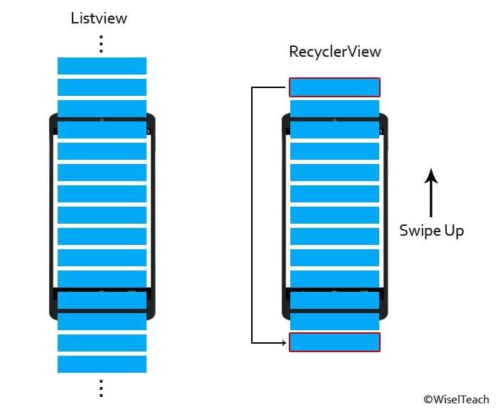

# [Android/Kotlin] 리사이클러 뷰(Recycler View)란?


* toc
{:toc}


## 📌  리사이클러 뷰(Recycler View)란?

- >**RecyclerView는 한정적인 화면에 많은 데이터를 넣을 수 있는 View이다.**
- **Recycle을 한국어로 하면 재활용하다라는 뜻이다.**
- **즉, View를 재활용해서 사용하는 방법이다.**어댑터 뷰의 항목 하나는 단순한 문자열이나 이미지뿐만 아니라,다수의 문자열이나 이미지를 포함하는 임의의 뷰가 될 수 있다.


## 🤔 ListView 와 RecyclerView 차이점

### **ListView**

- 사용자가 스크롤 할 때마다 위에 있던 아이템은 삭제되고, 맨 아래의 아이템은 생성 되길 반복한다.
- 아이템이 100개면 100이 삭제 생성된다. 즉 계속 삭제와 생성을 반복하므로 성능에 좋지 않다.

### RecyclerView

- 사용자가 스크롤 할 때, 위에 있던 아이템은 재활용 돼서 아래로 이동하여 재사용 한다.
- 즉 아이템이 100개여도 10개정도의 View만 만들고 10개를 재활용해서 사용한다.
- View를 계속 만드는 ListView의 단점을 보완하기 위해 나왔다.



## 👨🏻‍💻 RecyclerView 사용절차

### 1) Adapter

- Adapter란 데이터 테이블을 목록 형태로 보여주기 위해 사용되는 것으로, 데이터를 다양한 형식의 리스트 형식을 보여주기 위해서 데이터와 RecyclerView 사이에 존재하는 객체이다.
- 즉 데이터와 RecyclerView 사이의 통신을 위한 연결체이다.

### 2) ViewHolder

- ViewHolder란 화면에 표시될 데이터나 아이템들을 저장하는 역할 입니다.
- RecyclerView의 개념을 적용하기위해선 스크롤 해서 위로 올라간 View를 재활용하기 위해서 이 View를 기억하고 있어야 합니다. ViewHolder가 그역할을 합니다.


## 👨🏻‍💻 RecyclerView 예제

#### 1. 커스텀 항목을 위한 **XML 레이아웃 정의**

- res/layout의 경로에 새로운 **item_recyclerview.xml** 파일 생성

##### item_recyclerview.xml

```kotlin
<?xml version="1.0" encoding="utf-8"?>
<LinearLayout xmlns:android="http://schemas.android.com/apk/res/android"
    android:layout_width="match_parent"
    android:layout_height="wrap_content"
    android:orientation="horizontal"
    >
    <ImageView
        android:id="@+id/iconItem"
        android:layout_width="@dimen/icon_size"
        android:layout_height="@dimen/icon_size"
        android:scaleType="centerCrop"
        android:padding="@dimen/icon_padding"
        android:layout_gravity="center_vertical"
        android:layout_weight="1"
        android:src="@drawable/cat1"
        />
    <LinearLayout
        android:orientation="vertical"
        android:layout_width="wrap_content"
        android:layout_height="wrap_content"
        android:layout_weight="2">
        <TextView
            android:id="@+id/textItem1"
            android:layout_width="wrap_content"
            android:layout_height="wrap_content"
            android:textColor="@color/black"
            android:textSize="@dimen/list_item_text_size1"
            android:padding="@dimen/list_item_padding"
            android:hint="Name"
            />
        <TextView
            android:id="@+id/textItem2"
            android:layout_width="wrap_content"
            android:layout_height="wrap_content"
            android:textColor="@color/black"
            android:textSize="@dimen/list_item_text_size2"
            android:padding="@dimen/list_item_padding"
            android:hint="Age"
            />
    </LinearLayout>
</LinearLayout>
```

- Item.xml의 코드에서 ImageView,TextView의 크기 및 padding등의 속성은 따로 res/values경로에 **dimension 리소스**를 만들어 정의해주었다.

##### dimens.xml

```kotlin
<resources>
<!-- Default screen margins, per the Android Design guidelines. -->
<dimen name="activity_horizontal_margin">16dp</dimen>
<dimen name="activity_vertical_margin">16dp</dimen>
<dimen name="list_item_text_size1">20dp</dimen>
<dimen name="list_item_text_size2">16dp</dimen>
<dimen name="list_item_padding">4dp</dimen>
<dimen name="icon_size">60dp</dimen>
<dimen name="icon_padding">8dp</dimen>
</resources>
```


#### 2. 항목 관련 **데이터 클래스 정의**

- 커스텀뷰에 표시할 데이터를 MyItem DataClass로 정의해주었다.

##### MyItem.kt

```kotlin
data class MyItem(val aIcon:Int, val aName:String, val aAge:String) {}
```

#### [⭐️ 데이터클래스(Data Class)란? ⭐️](https://softychoo.github.io/devlog/android/2024-01-19-dataClass/) ⬅ 클릭하여 알아보기!!


#### 3. 어댑터 클래스정의

- **앞서 정의한 MyItem타입의 객체들을 ArrayList로 관리하는 MyAdapter클래스를RecyclerView.Adapter를 파생하여 정의**

##### RecyclerViewAdapter.kt

```kotlin
package com.example.customrecyclerview.Adaptor

import android.view.LayoutInflater
import android.view.View
import android.view.ViewGroup
import androidx.recyclerview.widget.RecyclerView
import com.example.customrecyclerview.Data.MyItem
import com.example.customrecyclerview.databinding.ItemRecyclerviewBinding

class RecyclerViewAdaptor(val mItems: MutableList<MyItem>) : RecyclerView.Adapter<RecyclerViewAdaptor.Holder>() {

    interface ItemClick { //인터페이스를 선언해서 Click시 데이터를 전달 Adaptora와 Activity사이의 통신(데이터 전달을 위해 만들어준다.)
        fun onClick(view : View, position : Int)
    }

    var itemClick : ItemClick? = null // 요기 예를 만듬

    override fun onCreateViewHolder(parent: ViewGroup, viewType: Int): Holder {
        val binding = ItemRecyclerviewBinding.inflate(LayoutInflater.from(parent.context), parent, false)
        return Holder(binding)
    }

    override fun onBindViewHolder(holder: Holder, position: Int) {
        holder.itemView.setOnClickListener {  //클릭이벤트추가부분
            itemClick?.onClick(it, position)
        }
        holder.iconImageView.setImageResource(mItems[position].aIcon)
        holder.name.text = mItems[position].aName
        holder.age.text = mItems[position].aAge
    }

    override fun getItemId(position: Int): Long {
        return position.toLong()
    }

    override fun getItemCount(): Int {
        return mItems.size
    }

    inner class Holder(val binding: ItemRecyclerviewBinding) : RecyclerView.ViewHolder(binding.root) {
        val iconImageView = binding.iconItem
        val name = binding.textItem1
        val age = binding.textItem2
    }
}
```


#### 4. 화면 레이아웃에 **RecyclerView 위젯 정의**

- **화면 레이아웃에 RecyclerView 위젯을 추가한다.**
- **XML레이아웃 파일에 정의된 RecyclerView 위젯을 Kotlin코드에서 참조하기 위하여 id속성을정의한다.**

##### Activity_recyclerview_view.xml

```kotlin
...
<androidx.recyclerview.widget.RecyclerView
		android:id="@+id/recycelrView"
    android:layout_width="match_parent"
    android:layout_height="match_parent"/>
...
```


#### 5. 어댑터를 생성하고 **어댑터뷰 객체에 연결**

RecyclerViewActivity.kt 파일에서 다음 역할의 코드를 추가한다.

1. 어댑터 객체에서 관리할 항목 데이터의 ArrayList 객체를 준비한다.
2. MyAdapter 객체를 생성하고 초기화 한다.
3. 생성된 MyAdapter 객체를 어댑터뷰인 리스트뷰에 연결한다.

##### RecyclerViewActivity.kt 

```kotlin
class RecyclerViewActivity : AppCompatActivity() {
    private lateinit var binding :ActivityRecyclerViewBinding
    override fun onCreate(savedInstanceState: Bundle?) {
        super.onCreate(savedInstanceState)
        binding = ActivityRecyclerViewBinding.inflate(layoutInflater)
        setContentView(binding.root)

        // 데이터 원본 준비
        val dataList = mutableListOf<MyItem>()
        dataList.add(MyItem(R.drawable.cat1, "Bella", "1"))
        dataList.add(MyItem(R.drawable.cat2, "Charlie", "2"))
        dataList.add(MyItem(R.drawable.cat3, "Daisy", "1.5"))
        dataList.add(MyItem(R.drawable.cat4, "Duke", "1"))
        dataList.add(MyItem(R.drawable.cat5, "Max", "2"))
        dataList.add(MyItem(R.drawable.cat6, "Happy", "4"))
        dataList.add(MyItem(R.drawable.cat7, "Luna", "3"))
        dataList.add(MyItem(R.drawable.cat8, "Bob", "2"))
        dataList.add(MyItem(R.drawable.cat9, "Mini", "1"))

      	//어댑터 생성 및 연결
        val adapter = RecyclerViewAdaptor(dataList) // itemClick을 사용하기 위하여 Adaptor을 따로 선언 :)
        binding.recycelrView.adapter = adapter 

        binding.recycelrView.layoutManager = LinearLayoutManager(this)//Recyclerview 수직배치

      	//클릭 이벤트 처리
        adapter.itemClick = object : RecyclerViewAdaptor.ItemClick {
            override fun onClick(view: View, position: Int) {
                val name: String = dataList[position].aName
                Toast.makeText(this@RecyclerViewActivity," $name 선택!", Toast.LENGTH_SHORT).show()
            }
        }
    }
}
```

#### [⭐️LayoutManager⭐️](https://softychoo.github.io/2023-08-24-LayoutManager/) ⬅ 클릭하여 알아보기!!


## 🎉 완성본

