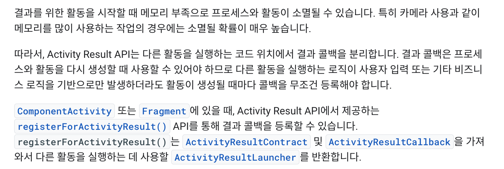

# [Android/Kotlin]⭐️registerForActivityResult란?⭐️

기존 데이터를 주고받을 때 사용했던 `startActivityForResult()`가 **derpecated**되고 대체로 나온 **`registerForActivityResult()`**에 대해서 알아보자!


* toc
{:toc}


[`ComponentActivity`](https://developer.android.com/reference/androidx/activity/ComponentActivity?hl=ko) 또는 [`Fragment`](https://developer.android.com/reference/androidx/fragment/app/Fragment?hl=ko)에 있을 때, Activity Result API에서 제공하는 [`registerForActivityResult()`](https://developer.android.com/reference/androidx/activity/result/ActivityResultCaller?hl=ko#public-methods_1) API를 통해 결과 콜백을 등록할 수 있습니다. `registerForActivityResult()`는 [`ActivityResultContract`](https://developer.android.com/reference/androidx/activity/result/contract/ActivityResultContract?hl=ko) 및 [`ActivityResultCallback`](https://developer.android.com/reference/androidx/activity/result/ActivityResultCallback?hl=ko)을 가져와서 다른 활동을 실행하는 데 사용할 [`ActivityResultLauncher`](https://developer.android.com/reference/androidx/activity/result/ActivityResultLauncher?hl=ko)를 반환합니다.


## 👨🏻‍💻 registerForActivityResult란?

### <span style="color: #2D3748; background-color:#fff5b1;"> 📌 활동 결과 가져오기</span>


- **Developers 공식 사이트에선 다음과 같이 설명하고 있다.**
- 위의 내용을 확인해 보면 기존의  `startActivityForResult()`,`onActivityResult()`를 deprecated하고 registerForActivityResult()를 사용하길 **권장**한다는 것을 알 수 있다.
- 단방향이 아닌 양방향으로 다른 **`Activity`** 혹은 **`Fragment`**를 실행하고 그 결과값으로 데이터를 넘겨받을 수 있다는 것을 의미한다.


### <span style="color: #2D3748; background-color:#fff5b1;"> 📌 활동 결과에 콜백 등록</span>



- **예제 코드로 콜백을 등록하는 과정을 확인해보자**
- 나는 먼저 MainActivity에 데이터를 넘겨받을 **`resultLauncher`**를 생성해주었다.
- 다음으로 넘겨받은 결과값(result)의 데이터를 저장해줄 형식을 지정해주었다.

```kotlin
resultLauncher = registerForActivityResult(ActivityResultContracts.StartActivityForResult()) // 런처 생성
{ result ->
		if (result.resultCode == RESULT_OK) { //데이터를 넘겨받아 myData변수에 저장해줌
				var myData = result.data?.getStringExtra("input_data").toString()      
    } 
 		else if (result.resultCode == RESULT_CANCELED) {
    		Toast.makeText(this, "데이터를 넘겨받지 않음", Toast.LENGTH_SHORT).show()
    }
}
```


##### Standard activity result

- <span style="color: Red;"> RESULT_OK </span>와 <span style="color: Red;">RESULT_CANCELED</span>는<span style="color: #2D3748; background-color:#fff5b1;"> 📌 별도의 클래스에서 활동 결과 수신</span> 에서 결과값 이외에도 어떤 동작을 할지 콜백을 받을 수 있게 넣어주는 값이라고 보면 될 것 같다.

- **`Cmd`+ 좌클릭**을 통해 들어가보면 다음과 같이 **Android내에서 기본으로 제공되는 결과값인 것을 알 수 있다.**
- 만약 여러개의 case를 두고싶다면 본인이 직접 값을 정하여 넣어주면 된다.

```kotlin
/** Standard activity result: operation canceled. */
public static final int RESULT_CANCELED    = 0;
/** Standard activity result: operation succeeded. */
public static final int RESULT_OK           = -1;
```


### <span style="color: #2D3748; background-color:#fff5b1;"> 📌 결과를 위한 활동 실행</span>


- **위의 공식 사이트의 글을 확인하면 `launch()`를 호출하면 프로세스가 생성된다고 나와있고, 그 프로세스에서 사용자가 활동 후 반환을 해주면 `ActivityResultCallback`의 `onActivityResult()가`실행된다고 나와있다.** 
- 나는 두 번째 Activity에서 데이터를 받아올 것이기 때문에 두번 째 Activity실행과 동시에 **`launch()`**를 호출 해 주었다.

```kotlin
btnGetData.setOnClickListener {
		val intent = Intent(this@MainActivity, SecondActivity::class.java)
		resultLauncher.launch(intent)
}
```


### <span style="color: #2D3748; background-color:#fff5b1;">📌 별도의 클래스에서 활동 결과 수신</span>


- 다음의 코드는 **SecondActivity**의 코드이다.
- **`setResult()`**를 통해 Standard Result 또는 데이터값을 넘겨주었다.

```kotlin
btnCancel.setOnClickListener {
		setResult(RESULT_CANCELED) //데이터를 넘겨받지 않고 취소하는 경우
		finish()
}

btnInputData.setOnClickListener {
		val intent = Intent()
		intent.putExtra("input_data",binding.etTitle.text.toString()) // 넘겨받을 데이터의 name값"input_data"
		setResult(RESULT_OK,intent)
		finish()
}
```


##### 이제 실행을 하게되면 MainAvtivity에서 SecondActivity를 실행할 때 `lunch()`를 호출하게 되고 SecondActivity가 실행되게 된다.

##### 그 다음 SecondActivity에서 내가 원하는 동작을 하게 되면 `setResult()`로 값을 넘겨주고 MainActivity의 MyData변수안에 값이 저장되게 된다.