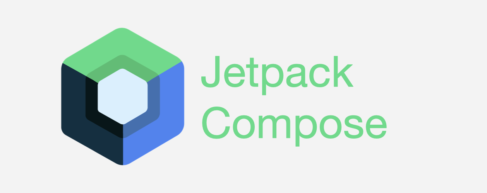

# [Android Jetpack Compose] Stateful & Stateless란?

{:toc}

**💡 remeber를 사용해서 stateful을 가져가게 된다면 Composable의 재사용성이 많이 떨어지게 되므로 `state hoisting pattern`을 사용해서 stateless 패턴으로 사용하자**

 

Compose의 컴포저블 함수는 2종류(Stateful, Stateless)로 나뉜다. 각각의 살펴보면 상태를 가지고 있다면 Stateful 상태를 가지고 있지 않다면 Stateless로 불리지 않을까 유추가 된다.

자세히 알아보기 위해 먼저 Developer 의 설명을 봐보자 

[[ Develpoer ]](https://developer.android.com/jetpack/compose/state?hl=ko#stateful-vs-stateless)

> `remember`를 사용하여 객체를 저장하는 컴포저블은 **내부 상태를 생성하여 컴포저블을스테이트풀(Stateful)로 만듭니다.** HelloContent`는 내부적으로 `name 상태를 보존하고 수정하므로 스테이트풀(Stateful) 컴포저블의 한 예가 됩니다. 이는 호출자가 상태를 제어할 필요가 없고 상태를 직접 관리하지 않아도 상태를 사용할 수 있는 경우에 유용합니다. 그러나 내부 상태를 갖는 컴포저블은 재사용 가능성이 적고 테스트하기가 더 어려운 경향이 있습니다.
>
> **스테이트리스(Stateless) 컴포저블은 상태를 갖지 않는 컴포저블입니다.** 스테이트리스(Stateless)를 달성하는 한 가지 쉬운 방법은 [상태 호이스팅](https://developer.android.com/jetpack/compose/state?hl=ko#state-hoisting)을 사용하는 것입니다.
>
> 재사용 가능한 컴포저블을 개발할 때는 동일한 컴포저블의 스테이트풀(Stateful) 버전과 스테이트리스(Stateless) 버전을 모두 노출해야 하는 경우가 있습니다. 스테이트풀(Stateful) 버전은 상태를 염두에 두지 않는 호출자에게 편리하며, 스테이트리스(Stateless) 버전은 상태를 제어하거나 끌어올려야 하는 호출자에게 필요합니다.

즉 Developer의 설명에 따르자면 다음과 같이 정의할 수 있다.

- Stateful Composable : 내부적으로 상태를 가지고 있는 컴포저블
- Stateless Composable : 내부적으로 상태를 가지고 있지 않는 컴포저블

 

다음으로 Codelabs 의 설명을 살펴보자

[[ Codelabs ]](https://developer.android.com/codelabs/jetpack-compose-state?hl=ko&continue=https%3A%2F%2Fdeveloper.android.com%2Fcourses%2Fpathways%2Fcompose%3Fhl%3Dko%23codelab-https%3A%2F%2Fdeveloper.android.com%2Fcodelabs%2Fjetpack-compose-state#8)

> 구성 가능한 함수에서 모든 상태를 추출할 수 있는 경우 결과로 생성되는 구성 가능한 함수를 스테이트리스(Stateless)라고 합니다.
>
> **스테이트리스(Stateless)** 컴포저블은 상태를 소유하지 않는 컴포저블입니다. 즉, 새 상태를 보유하거나 정의하거나 수정하지 않습니다. **스테이트풀(Stateful)** 컴포저블은 시간이 지남에 따라 변할 수 있는 상태를 소유하는 컴포저블입니다. 실제 앱에서는 컴포저블의 기능에 따라 컴포저블을 100% 스테이트리스(Stateless)로 하는 것은 어려울 수 있습니다. 컴포저블이 가능한 한 적게 상태를 소유하고 적절한 경우 컴포저블의 API에 상태를 노출하여 상태를 끌어올릴 수 있도록 컴포저블을 디자인해야 합니다.

즉 Codelabs에선 다음과 같이 말하고 있다.

- Stateful Composable : 시간이 지나면서 변할 수 있는 상태를 갖는 컴포저블
- Stateless Composable : 새로운 상태를 보유, 정의, 수정하지 않는 컴포저블이다

 

## 📌 Stateful & Stateless Composable란?

| Stateful Composable                                        | Stateless Composable                                         |
| ---------------------------------------------------------- | ------------------------------------------------------------ |
| 시간이 지나면서 변할 수 있는 상태를 갖는 컴포저블          | 새로운 상태를 보유, 정의, 수정하지 않는 컴포저블이다         |
| 상태가 변하게 되면 자기 자신과 자식의 Composable 을 재구성 | 상태가 없기 때문에 스스로 재구성을 할수 없으며 부모의 Composable이 재구성되어야 자신이 재구성 |

추가적으로 developer, 코드랩 등을 보면 상태를 끌어올린다는 문구를 볼 수 있는데, 이는 자신이 가지고 있는 상태를 부모 Composable 로 넘겨주어 자기 자신을 Stateless Composable로 바꿔주는 상태 호이스팅에 대한 설명임을 확인했다. 
그러므로 다음번엔 상태 호이스팅에 대해 알아보도록 하겠다 :)

 

## Link!!

#### [State Hoisting](https://softychoo.github.io/devlog/android/2024-01-10-State-Hoisting/)

