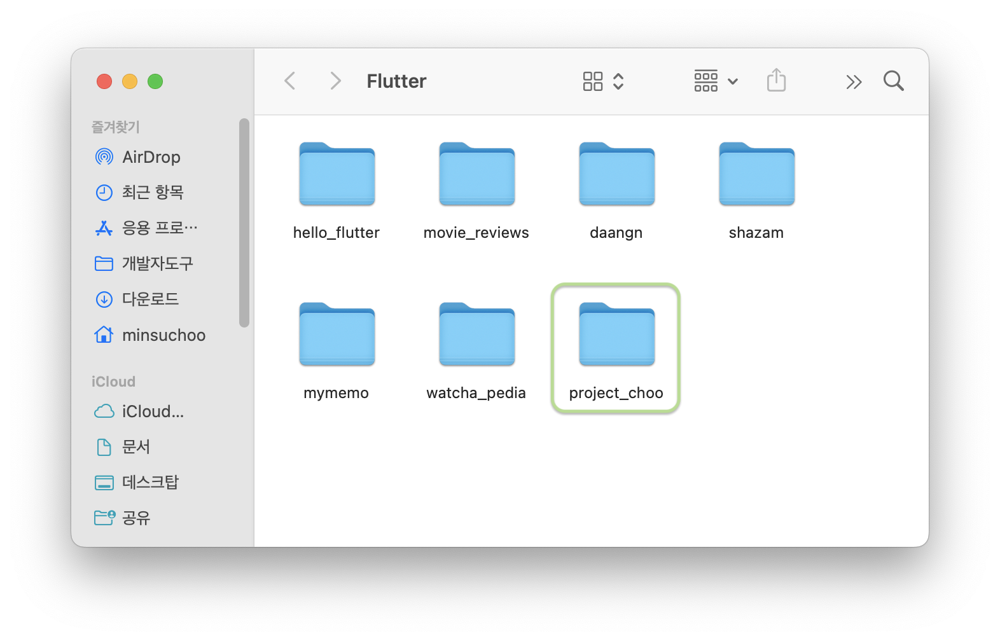
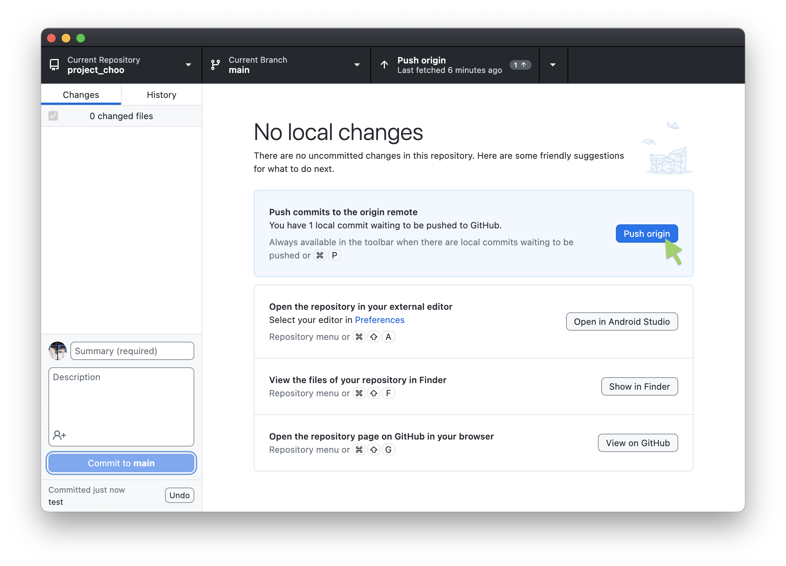

# [Github] 깃허브 레포지토리 쉽게 연결하는 방법

컴퓨터상의 폴더를 깃허브에 쉽게 연결하는 방법에 대해 알아보자! **Git Clone**!!

* toc
{:toc}

## 1. 레포지토리 만들기 

먼저 폴더 이름과 동일한 이름의 레포지토리를 만들어준다.

## 2. Git Clone

**GitHub Desktop**을 열고 "Clone Repository"버튼을 클릭한다.

Desktop에 Clone하면 바탕화면에 폴더가 생긴다.

## 3. 내용 이동

바탕화면의 폴더로 파일을 옮겨준다.

GitHub Desktop에 들어가보면 정상적으로 파일이 추가되었다는 메시지를 볼 수 있다.

Commit 후 Push해준다.

## 4. 완료

이제 정상적으로 깃허브에 폴더가 연결되었다!
