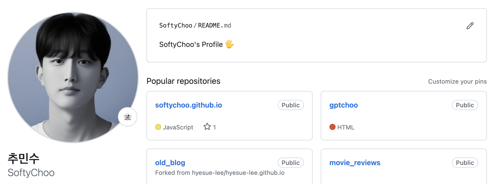
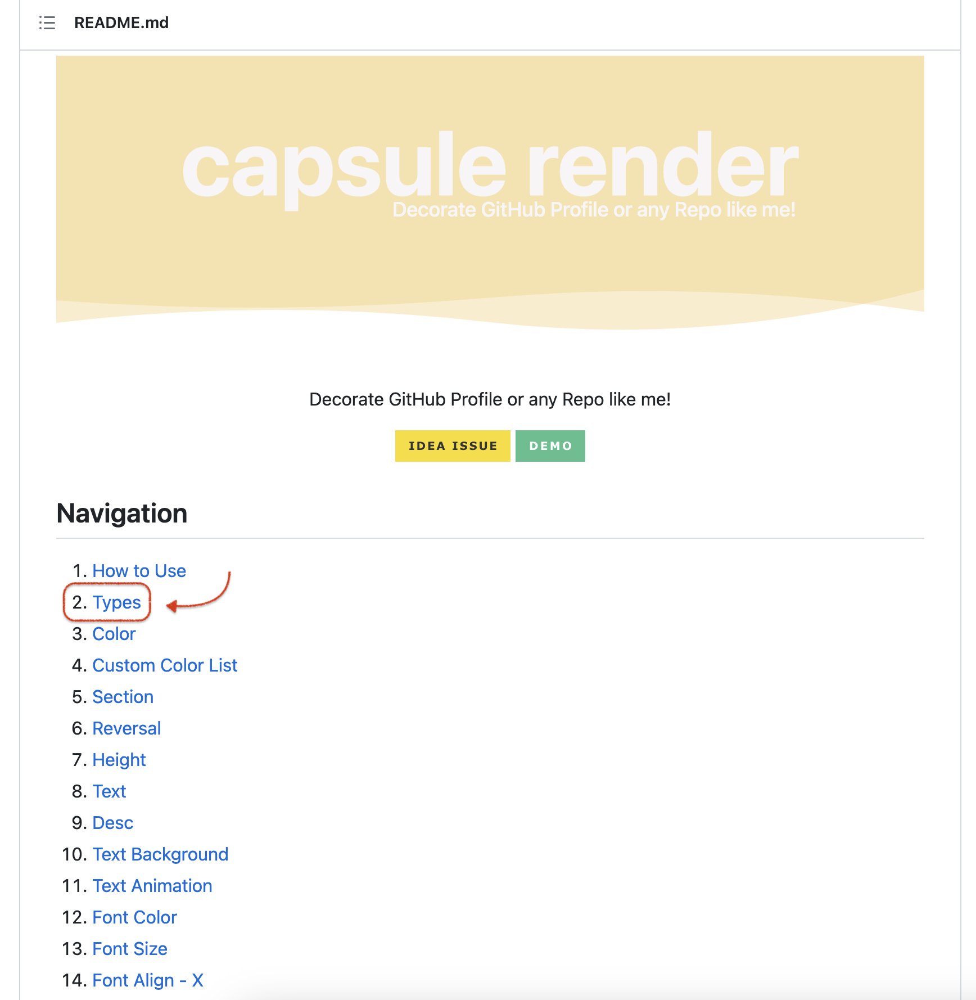
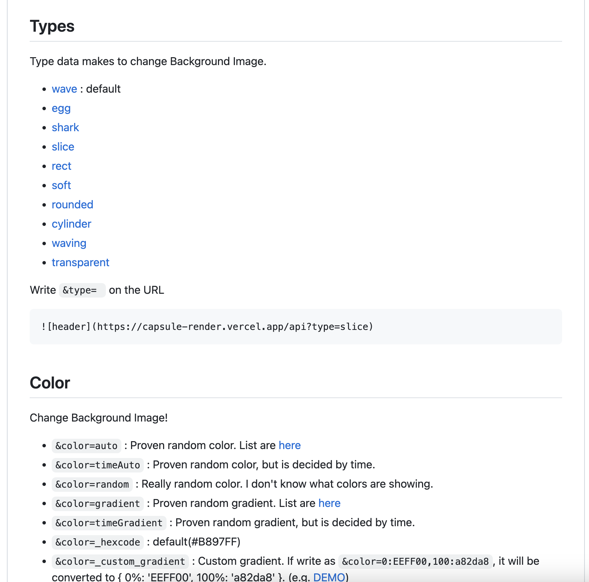

```
layout: post
title: Fix-It
accent_image: 
  background: url('/assets/img/change_img/book.jpg') center/cover
  overlay: false
accent_color: '#ccc'
theme_color: '#ccc'
description: >
  fixNote
invert_sidebar: true
categories :
 - devlog
 - fix-it
```

# [Github] GitHub Profile꾸미기!

README.md를 활용해 깃허브 프로필 꾸미기 :)


{:toc}


## My GitHub

- 먼저 꾸민 최종 결과물이다 :)   **[[Github Link]](https://github.com/SoftyChoo)**


## Step 1 : 프로필 생성하기

- 자신의 Github ➡  `Repository`  ➡  `New`를 클릭하여 신규 repository를 생성해준다.(이 때 이름을 자신의username과 동일하게 입력한다.)


- 나는 이미 레포지토리를 만들어 놓아서 다음과 같이 뜨지만 처음 생성한다면 **"You found a secret!"** 메시지와 함께 `README.md`로 깃허브 프로필을 작성할 수 있게 되었다는 메시지가 나온다!


- README file은 어차피 추가해주어야 하니 `Repository`를 생성할 때 추가 해주자!



- 그럼 다음과 같이 상단에 정상적으로 README.md 파일이 추가된 것을 확인할 수 있다.


## Step 2 : Header 만들기

- 이제 상단에 뜨는 Welcome을 만들어 보자.
- 먼저 다음의 링크에 들어간다 ➡ **[[Header 만들기 Link!]](https://github.com/kyechan99/capsule-render)**



- `Types` 를 눌러서 이동해주면



- 다음과 같이 헤더의 종류를 나타내는 