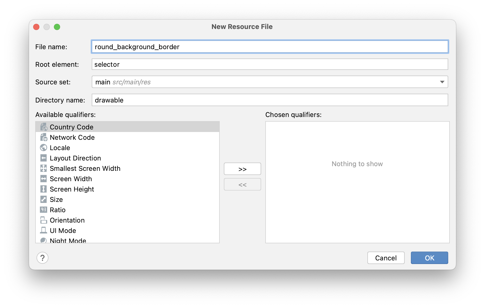

# [Android] (kotlin) ImageView 테두리 둥글게 프레임넣기

{:toc}

- AndroidStudio UI를 수정하던 중 ImageView의 테두리를 넣어주면 훨씬 가시성이 증가할 것 같아 방법을 알아보고 포스팅한다:)


## [초기] ImageView (적용 전)

- 이미지가 둥 떠있어서 배경과 어울리지 않는다.


## [Step 1] 리소스파일 추가

- **res /drawable** 경로에 원하는 이름의 새로운 Resource File을 만들어준다.



## [step 2] 코드작성

- 그 안의 코드를 다음과 같은 형식으로 수정해준다.

```xml
<?xml version="1.0" encoding="utf-8"?>
<shape xmlns:android="http://schemas.android.com/apk/res/android"
    android:shape="rectangle" >
    <solid android:color="#00ff0000" /> <!--배경색 설정-->
    <corners
        android:radius="30dp"/> <!--테두리의 둥근 정도 설정-->
    <stroke
        android:width="2dp"		 
        android:color="@color/black" /> <!--테두리의 두께와 색 설정-->
</shape>
```

- 나는 배경을 투명색으로 해주기 위해 투명색 색상코드인 `#00ff0000` 로 설정해주었다.
- radius는 테두리 모서리의 둥근 정도
- width는 테두리의 두께를 설정해준다


## [step 3] activity.xml 파일 변경

- 진행하던 xml파일로 돌아가 다음과 같은 형식으로 코딩해준다.

```xml
<LinearLayout
        android:id="@+id/layout_img_border"
        android:background="@drawable/round_backgroud_border"	  background에 설정한 스타일 넣기
        android:padding="2dp"   																설정한 테두리 두께만큼 패딩 넣기
        android:layout_gravity="center"
        android:layout_width="wrap_content"
        android:layout_height="wrap_content"
        app:layout_constraintBottom_toTopOf="@+id/textView11"
        app:layout_constraintEnd_toEndOf="parent"
        app:layout_constraintStart_toStartOf="parent"
        app:layout_constraintTop_toTopOf="parent"
        tools:ignore="MissingConstraints">
        <ImageView
            android:id="@+id/iv_change"
            android:layout_width="200dp"
            android:layout_height="200dp"
            android:layout_gravity="center"
            android:scaleType="centerCrop"
            android:background="@drawable/round_backgroud_border" background에 설정한 스타일 넣기
            />
    </LinearLayout>
```


## [step 4] 

```kotlin
val changeImg = findViewById<ImageView>(R.id.iv_change)
changeImg.clipToOutline = true
```

- 이미지를 배경에 맞게 잘라주는 함수인 clipToOutlined을 사용하여 테두리에 맞게 잘라줌


## [결과] ImageView 적용 후

- 다음과 같이 배경과 찰떡인 프레임이 완성되었다 :)


