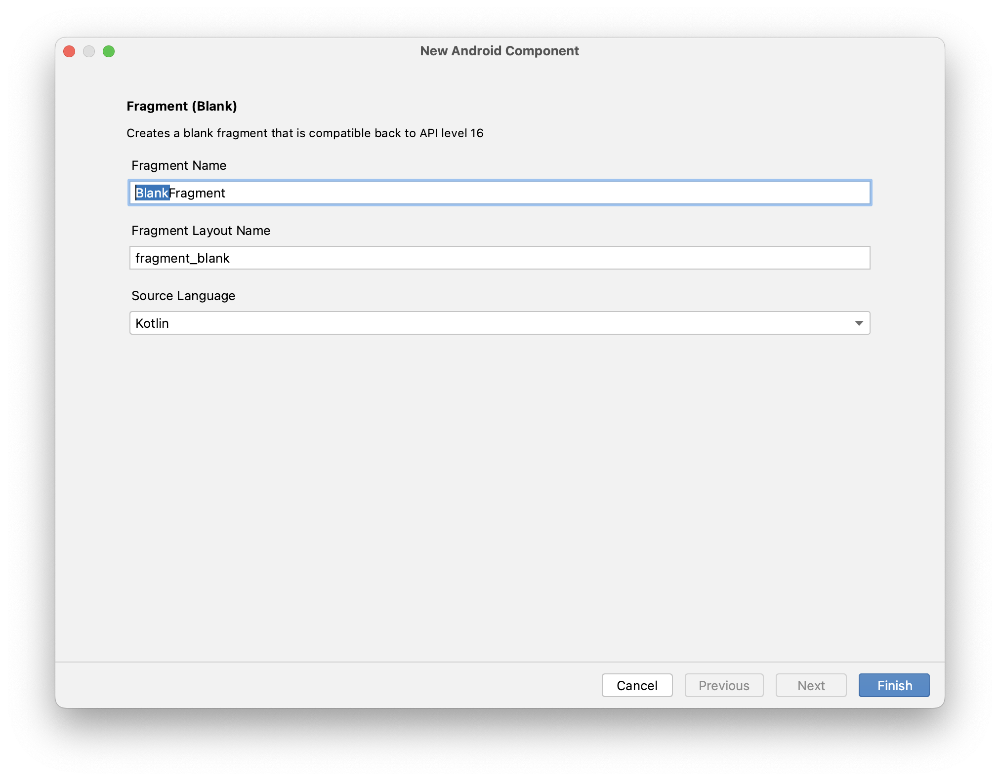

# [Android/Kotlin] ViewPager + TabLayout을 사용해 스와이프 뷰 만들기

{:toc}


## [Step 1] activity_main.xml 수정

- **activity_main.xml**에 **TableLayout**과 **ViewPager**를 추가해준다.

```xml
		<com.google.android.material.tabs.TabLayout
        android:id="@+id/tab"
        android:layout_width="match_parent"
        android:layout_height="wrap_parent" />

    <androidx.viewpager.widget.ViewPager
        android:id="@+id/viewPager"
        android:layout_width="match_parent"
        android:layout_height="match_parent" />
```


## [Step 2] Fragment 추가 

- 다음으로 화면을 구성할 **Fragment**를 추가해준다.
- Fragment는 화면을 구성할 페이지 개수만큼 추가해주면 된다. (나는 두개가 필요하기 때문에 2개의 Fragment를 만들어주었다.)



- 이름은 위의 사진에서 드래그된 부분만 변경해 **``TodoFragment``**와 **``BookmartFragment``**로 지정해주었다.

## [Step 3] Fragment 수정

- Fragment가 생성되면 코드가 길게 적혀있는데 나는 다음과 같이 사용할 onCreatView만 남기고 지워주었다.

```kotlin
package com.example.camp

import android.os.Bundle
import androidx.fragment.app.Fragment
import android.view.LayoutInflater
import android.view.View
import android.view.ViewGroup

class TodoFragment : Fragment() {
    override fun onCreateView(
        inflater: LayoutInflater, container: ViewGroup?,
        savedInstanceState: Bundle?
    ): View? {
        // Inflate the layout for this fragment
        return inflater.inflate(R.layout.fragment_todo, container, false)
    }
}
```


## [Step 4] `newInstance()`함수 추가

- 각각의 Fragment에 다음의 `newInstance()`함수를 추가해준다.

```kotlin
 fun newInstant() : TodoFragment
    {
        val args = Bundle()
        val frag = TodoFragment()
        frag.arguments = args
        return frag
    }
```


## [Step 5] FragmentAdapter클래스 생성

- 동작에 따라 다른 Fragment를 보여주도록 FragmentAdapter를 만들어준다.

```kotlin
package com.example.camp

import androidx.fragment.app.Fragment
import androidx.fragment.app.FragmentManager
import androidx.fragment.app.FragmentPagerAdapter

class FragmentAdapter (fm : FragmentManager): FragmentPagerAdapter(fm) {
    //position 에 따라 원하는 Fragment로 이동시키기
    override fun getItem(position: Int): Fragment {
        val fragment =  when(position)
        {
            0->TodoFragment().newInstant()
            1-> BookmarkFragment().newInstant()
            else -> TodoFragment().newInstant()
        }
        return fragment
    }

    //tab의 개수만큼 return
    override fun getCount(): Int = 2

    //tab의 이름 fragment마다 바꾸게 하기
    override fun getPageTitle(position: Int): CharSequence? {
        val title = when(position)
        {
            0->"Todo"
            1->"Bookmark"
            else -> "main"
        }
        return title     }
}
```


## [Step 6] MainActivity.kt에 `TabActivity`와 `ViewPager` 연결

- MainActivity.kt의 onCreate 안에 다음과 같은 코드를 추가시켜줍니다. 

```kotlin
				//------------------------------------------------------------//
        //FragmentAdatper 객체인 pageAdapter를 ViewPager의 Adpater로 연결 후
        //ViewPager와 Tab을 setupWithViewPager로 연결해준다.
        val pagerAdapter = FragmentAdapter(supportFragmentManager)
        val pager = findViewById<ViewPager>(R.id.viewPager)
        pager.adapter = pagerAdapter
        val tab = findViewById<TabLayout>(R.id.tab)
        tab.setupWithViewPager(pager)
        //------------------------------------------------------------//
```


## [동작확인]


