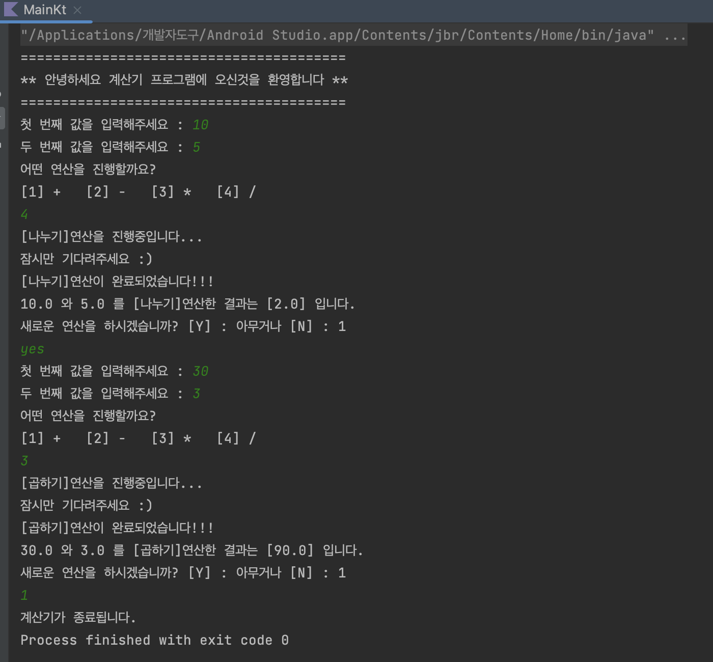

# [TIL] MyHotel

코틀린 문법을 복습하던 중 만들어본 호텔 예약 과제


* toc
{:toc}


## Main.kt

```kotlin
package com.example.myhotel

import java.util.Random

fun main() {
    var reserve = Reservation()
    var check = Check()
    var check_asc = Check_ASC()
    var account = Account()
    var change = Change()
    // 4x900 2차원 배열 선언
    var array = Array(900) { arrayOfNulls<String>(6) }
    println("안녕하세요 호텔예약 프로그램 입니다.")
    while (true) {
        println("----------------------------------------------------------------------------------")
        println("[메뉴]\n1.방예약 2.예약목록출력 3.예약목록 정렬(오름차순) 4.시스템종료 5.입출금 내역 출력 6.예약 변경/취소")
        print("입력 : ")
        var menu = readLine()!!.toInt()

        when (menu) {
            1 -> {
                reserve.reserve(array)
                println("호텔 예약이 완료되었습니다.")
            }
            2 -> {
                check.check(array)
            }
            3 -> {
                check_asc.check_asc(array)
            }
            4 -> {
                print("시스템을 종료합니다.")
                return
            }
            5 -> {
                account.account(array)
            }
            6 -> {
                change.change(array)
            }
            else -> println("올바르지 않은 값을 입력하였습니다. 다시 입력해주세요!")
        }
    }
}
```

## Class `Reservation`

```kotlin
package com.example.myhotel

import java.util.Random

class Reservation() {

    var today: String = "20230721"
    var room : String = ""
    var checkIn : String= ""
    var checkOut : String = ""

    val random = Random()
    fun rand(from: Int, to: Int) : Int {
        return random.nextInt(to - from) + from
    }
    fun reserve(array: Array<Array<String?>>) {
        println("예약자분의 성함을 입력해주세요")
        var name = readLine()!!.toString()

        while (true)
        {
            //예약날짜 겹치면 안되게 구현 예정
            break
        }
        while(true){
            println("100~999사이의 예약할 방 번호를 입력해주세요")
            room = readLine()!!.toString()
            if (100 <= room.toInt() && room.toInt() <=999) break
        }
        while (true){
            println("체크인 날짜를 입력해주세요[오늘 날짜 : "+today+"],[입력형식:20230502]")
            checkIn = readLine()!!.toString()
            if(checkIn.toInt() <today.toInt()) println("지난 날짜는 예약이 불가능합니다.")
            else break
        }
        while (true)
        {
            println("체크아웃 날짜를 입력해주세요 ,[입력형식:20230502]")
            checkOut = readLine()!!.toString()
            if(checkOut.toInt()<=checkIn.toInt()) println("체크인 이후의 날짜를 입력해주세요!")
            else break
        }
        for(i in 0..899)
        {
            if(array[i][0]==null){
                array[i][0] = name
                array[i][1] = room
                array[i][2] = checkIn
                array[i][3] = checkOut
                array[i][4] = rand(500000,600000).toString() //호텔 숙소비
                array[i][5] = (array[i][4]!!.toInt() * 0.1).toString() // 호텔 숙박비의 10% 예약금

                println("호텔 숙박비["+array[i][4]+"원]의 10%인 예약금["+array[i][5]+"원]을 입금해주세요!")
                break
            }
        }
    }
}
```

## Class `AbstractOperation`

```kotlin
abstract class AbstractOperation {
    abstract fun operate(a : Double,b:Double):Double
}
```

## Class `Check`

```kotlin
package com.example.myhotel

class Check() {
    fun check(array: Array<Array<String?>>) {
        println("호텔 예약자 목록입니다.")
        var count = 1
        for(i in 0..899)
        {
            if(array[i][0]!=null)
            {
                println("${count++}. 사용자: "+array[i][0]+",방번호: "+array[i][1]+",체크인: "+array[i][2]+",체크아웃: "+array[i][3])
            }
        }
    }
}
```

## Class `Check_ASC`

```kotlin
package com.example.myhotel

class Check_ASC() {
    fun check_asc(array: Array<Array<String?>>) {
        println("호텔 예약자 오름차순 목록입니다.")
        var count :Int = 11111111
//        for (i in 1..checkCount)
//        {
//            var
//            for(i in 0..899)
//            {
//                if(!(array[i][2] < count)){
//
//                }
//            }
//        }
    }
}
```

## Class `Account`

```kotlin
package com.example.myhotel

class Account() {
    fun account(array: Array<Array<String?>>) {
        println("조회하실 사용자 이름을 입력하세요")
        var name = readLine()!!.toString()
        for (i in 0..899) {
            if (array[i][0] == name) {
                println("방 " + array[i][1] + "호의 호텔 숙박비[" + array[i][4] + "원]의 10%인 예약금[" + array[i][5] + "원]이 출금되었습니다!")
            }
        }
    }
}
```

## Class `Change`

```kotlin
package com.example.myhotel

class Change() {

    fun change(array: Array<Array<String?>>) {
        val thisArray = arrayOfNulls<Int>(900)
        var count = 0
        var change: Int

        println("예약을 변경할 사용자 이름을 입력하세요")
        var name = readLine()!!.toString()
        for (i in 0..899) {
            if (array[i][0] == name) {
                println(array[i][0] + "님이 예약한 목록입니다. 변경하실 방의 예약번호를 입력해주세요")
                break
            }
        }
        while (true) {
            for (i in 0..899) {
                if (array[i][0] == name) {
                    thisArray[count++] = i
                    println("${count}. 방번호: " + array[i][1] + ",체크인: " + array[i][2] + ",체크아웃: " + array[i][3])
                }
            }
            change = readLine()!!.toInt()
            if (thisArray[change] != null) break
            else println("범위에 없는 예약번호 입니다. 다시 입력해주세요")
        }
        while (true) {
            println("해당 예약 1.변경, 2.취소")
            var change2 = readLine()!!.toInt()
            when (change2) {
                1 -> break
                2 -> {
                    println("[취소 유의사항]")
                    println("체크인 3일 이전 취소 예약금 환불 불가")
                    println("체크인 5일 이전 취소 예약금의 30% 환불")
                    println("체크인 7일 이전 취소 예약금의 50% 환불")
                    println("체크인 14일 이전 취소 예약금의 80% 환불")
                    println("체크인 30일 이전 취소 예약금의 100% 환불")

                    array[thisArray[change]!!][0] = null
                    array[thisArray[change]!!][1] = null
                    array[thisArray[change]!!][2] = null
                    array[thisArray[change]!!][3] = null
                    array[thisArray[change]!!][4] = null
                    array[thisArray[change]!!][5] = null

                    println("취소가 완료되었습니다.")
                    break
                }

                else -> println("범위에 없는 번호 입니다. 다시 입력해주세요")
            }
        }
    }
}
```


## Result



